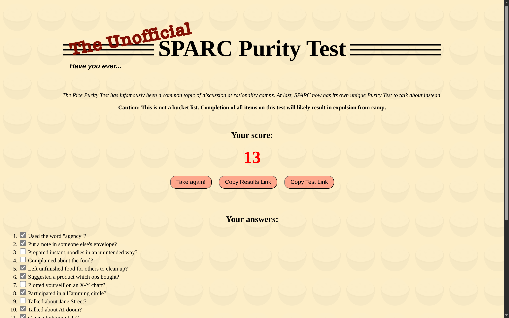

# Purity Test Maker


If you've been on the internet for a decently high amount of time, you're probably familiar with the [Rice Purity Test](https://ricepuritytest.com/) - an infamous assessment of innocence and a possibly way too common topic of discussion in various social circles. Unsurprisingly, the simple design of the original Purity Test is also particularly attractive for parodies and similar imitation quizzes.

But how about a website which lets anybody easily create their own Purity Tests to share with friends? That's exactly what this Purity Test Maker is for!

## Features

### 🍚 Familiar interface


Faithfully matches the UI of the original Rice Purity Test closely, besides a few modernisations

### ✍️ Intuitive editor


This could have been an HTML form... but that's too boring. WYSIWYG for the win!

### 🔗 Better results sharing



Click on _Copy Test Link_ to share a link to the Purity Test you're viewing, or click on _Copy Results Link_ to include your answers encoded in the URL - so you can share results anonymously and without any server-side storage.

## Run locally

To run the project locally, whether for your own deployment or for development, simply clone the repository and run the `dev` script (e.g. using `bun`):

```shell
git clone https://github.com/ThatOtherAndrew/purity-test-maker
cd purity-test-maker
bun dev --open
```

The repository also contains configuration files for Docker, fly.io and Nix.
